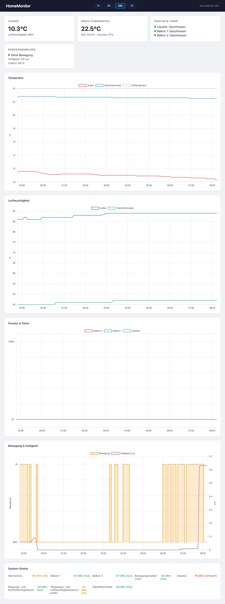

# HomeMonitor

Smart Home Sensor Data Collector and Dashboard. Polls sensor data via the Homematic IP Cloud API and visualizes it in a web dashboard.



## Features

- Collects sensor data every 5 minutes (temperature, humidity, window/door state, motion, power consumption, etc.)
- Web dashboard with live charts and auto-refresh
- Time range selection: 1h, 6h, 24h, 7d
- Runs as Docker containers

## Setup

### 1. Generate Auth Token

```bash
uvx --from homematicip hmip_generate_auth_token
```

The script will ask for:
- **SGTIN**: Found on the back of your Access Point (e.g. 3014-xxxx-xxxx-xxxx-xxxx-xxxx)
- **PIN**: If set in the app, otherwise leave empty

Then press the **blue button** on the Access Point.

This creates a `config.ini` in the current directory.

### 2. Copy config.ini

```bash
cp /path/to/config.ini ./config.ini
```

### 3. Start

```bash
docker compose up -d
```

The dashboard is available at **http://localhost:8080**.

### 4. Check Logs

```bash
docker compose logs -f
```

## Architecture

```
docker compose
├── collector   – Polls Homematic IP Cloud API, writes to SQLite
└── dashboard   – Flask web app on port 8080, reads SQLite
    └── data/homematic.db (shared volume)
```

## Configuration

| Setting | Default | Location |
|---------|---------|----------|
| Poll interval | 300s (5 min) | `collector.py` → `POLL_INTERVAL` |
| Dashboard port | 8080 | `docker-compose.yml` |
| Database | `./data/homematic.db` | `collector.py` → `DB_PATH` |

## Supported Metrics

| Metric | Description | Device Types |
|--------|-------------|-------------|
| temperature | Temperature in °C | Thermostats, sensors |
| humidity | Humidity in % | Sensors |
| setpoint_temperature | Target temperature | Thermostats |
| window_state | Window/door open/closed | Shutter contacts |
| motion_detected | Motion detected | Motion detectors |
| illumination | Brightness in Lux | Motion detectors |
| power_consumption | Power in W | Switch actuators |
| energy_counter | Energy in Wh | Switch actuators |
| smoke_alarm | Smoke alarm | Smoke detectors |
| water_detected | Water detected | Water sensors |
| low_battery | Battery low | All battery-powered |
| rssi | Signal strength | All devices |

## License

[MIT](LICENSE)
